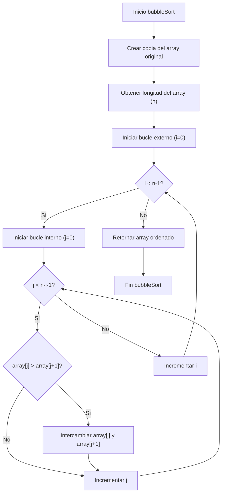

```mermaid
flowchart TD
    A["Inicio bubbleSort"] --> B["Crear copia del array original"]
    B --> C["Obtener longitud del array (n)"]
    C --> D["Iniciar bucle externo (i=0)"]
    D --> E{"i < n-1?"}
    E -->|"Sí"| F["Iniciar bucle interno (j=0)"]
    F --> G{"j < n-i-1?"}
    G -->|"Sí"| H{"array[j] > array[j+1]?"}
    H -->|"Sí"| I["Intercambiar array[j] y array[j+1]"]
    H -->|"No"| J["Incrementar j"]
    I --> J
    J --> G
    G -->|"No"| K["Incrementar i"]
    K --> E
    E -->|"No"| L["Retornar array ordenado"]
    L --> M["Fin bubbleSort"]
```	