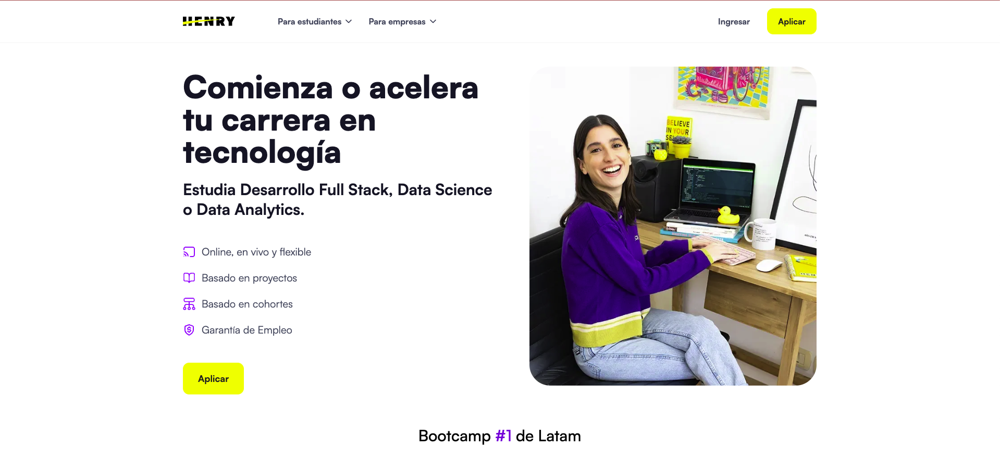
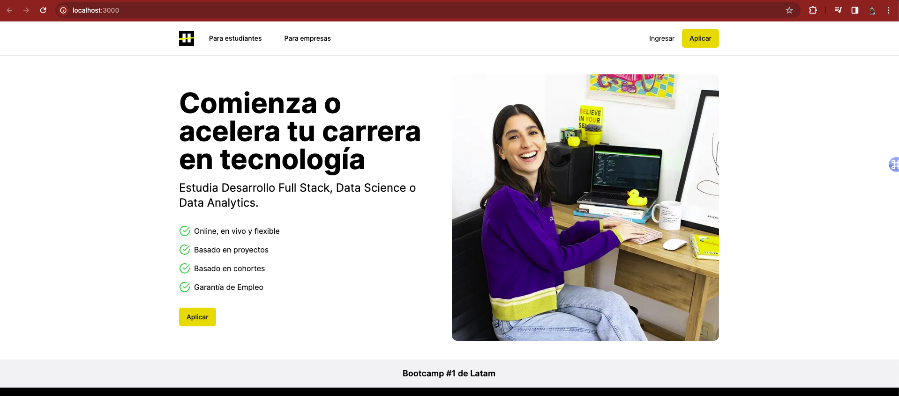

# Challenge: Frontend con IA
## Objetivo:
Utilizar una herramienta basada en IA para generar código de frontend (Next.js o React) a partir de una imagen de referencia del sitio web soyhenry.com.



## Setup:
1. Incializa el proyecto desde la terminal con el comando:
``` bash
npx create-next-app@latest solution 
```
2. Para usar v0.dev en tu proyecto, inicializalo con el comando:
``` bash
npx v0@latest init
```
###### `nota`: Recuerda usar landing-reference.png para generar el codigo.

3. V0 te permite agregar componentes directamente con el comando:
``` bash
npx v0 add XXXXXYYYYY
```

4. Recuerda modificar el archivo en `app/page.js` para importar el componente generado. Ejemplo:
``` javascript

import Component from '../components/component'; 

export default function Home() {
  return (
    <div className="App">
      <Component />
    </div>
  );
}
```

5. Explora el código generado y modifica el código para que se ajuste a lo visto en el diseño de referencia.

6. Si quieres ver el resultado, ejecuta el comando:
``` bash
npm run dev
``` 

7. Puedes ayudarte de el proyecto `solucion`, cuya vista se ve de la siguiente manera:


# Elementos Claves del Landing Page

## Navegación Superior (Nav bar)
- **Logo**: Debe estar situado en el extremo izquierdo.
- **Enlaces para usuarios**: 
  - `Para estudiantes`
  - `Para empresas`
- **Botones de acción**:
  - `Ingresar`
  - `Aplicar` (resaltado con un color de fondo distintivo).

## Sección Principal (Hero Section)
- **Título principal**: "Comienza o acelera tu carrera en tecnología".
- **Texto de acompañamiento**: "Estudia Desarrollo Full Stack, Data Science o Data Analytics".
- **Lista de características o ventajas** con íconos:
  - Online, en vivo y flexible.
  - Basado en proyectos.
  - Basado en cohortes.
  - Garantía de Empleo.
- **Botón de acción principal**: `Aplicar`, debe ser prominente.

## Imagen Representativa
- **Fotografía**: Debe relacionarse con la temática del aprendizaje o el ambiente de estudio.

## Pie de página o Faja Informativa
- **Texto promocional**: "Bootcamp #1 de Latam", mostrado en una barra horizontal.


## Requisitos Generales
1. Generar código de frontend utilizando cualquiera de las herramientas vistas a lo largo del curso.
2. Modificar el código generado para que se parezca lo más posible al diseño original de soyhenry.com.

## Criterios
- El código debe ser limpio y bien estructurado.
- Los nombres de las clases y los id deben ser descriptivos y seguir una convención consistente.
- **DOM**: Los elementos clave deben existir y corresponderse con la estructura del sitio original.

- **CSS**: Los estilos deben ser fieles al diseño de referencia.
- **Contenido**: Las imágenes y estructura deben coincidir con los del sitio original.

# Configuración de Pruebas Unitarias

Para garantizar la calidad del código del proyecto, se han incluido pruebas unitarias básicas que verifican la correcta renderización de los componentes esenciales del frontend. Sigue los siguientes pasos para configurar y ejecutar las pruebas.

### Paso 1: Estructura del Proyecto

Asegúrate de que tu proyecto tenga la siguiente estructura de carpetas:

```tree
/proyecto
--/__tests__
--/app
--/components
...
```


La carpeta `__tests__` contiene los archivos de prueba y debe estar en el nivel raíz de tu proyecto, al mismo nivel que las carpetas `app` y `components`.

### Paso 2: Instalación de Dependencias

Deberás instalar algunas dependencias de desarrollo necesarias para ejecutar las pruebas. Abre una terminal en la raíz de tu proyecto y ejecuta el siguiente comando:

```bash
npm install -D jest@27.5.1 jest-environment-jsdom@27.5.1 @testing-library/react@latest @testing-library/jest-dom@latest
```

Esto instalará las versiones específicas de Jest y jest-environment-jsdom, junto con las últimas versiones de @testing-library/react y @testing-library/jest-dom.

### Paso 3: Inicializar Jest
Después de instalar las dependencias, inicializa Jest ejecutando:
```bash
npm init jest@latest
```

### Paso 4: Configuración de Jest
Reemplaza el archivo jest.config.js en tu proyecto por el que se encuentra en la carpeta __tests__. Asegúrate de que las configuraciones sean consistentes con las necesidades de tu proyecto.

### Paso 5: Nomenclatura de Componentes
Si tu componente principal se llama de manera diferente, asegúrate de ajustar la importación en el archivo components.test.jsx de la siguiente manera:
```javascript
import { TuComponente } from '../components/tuComponente';
```
Si decides seguir la convención sugerida, simplemente nombra tu componente como Component.

### Paso 6: Scripts de Prueba
Añade el siguiente script en tu archivo package.json para facilitar la ejecución de las pruebas:
```json
"scripts": {
  "test": "jest"
},
```
### Paso 7: Ejecutar Pruebas
Con todo en su lugar, ahora puedes ejecutar las pruebas unitarias para verificar que los componentes se renderizan correctamente. Ejecuta el siguiente comando en la terminal:
```bash
npm test
```
Verás los resultados de las pruebas en la terminal. Asegúrate de que todas las pruebas pasen satisfactoriamente para confirmar que los elementos básicos se renderizan como se espera.
Buena suerte!
