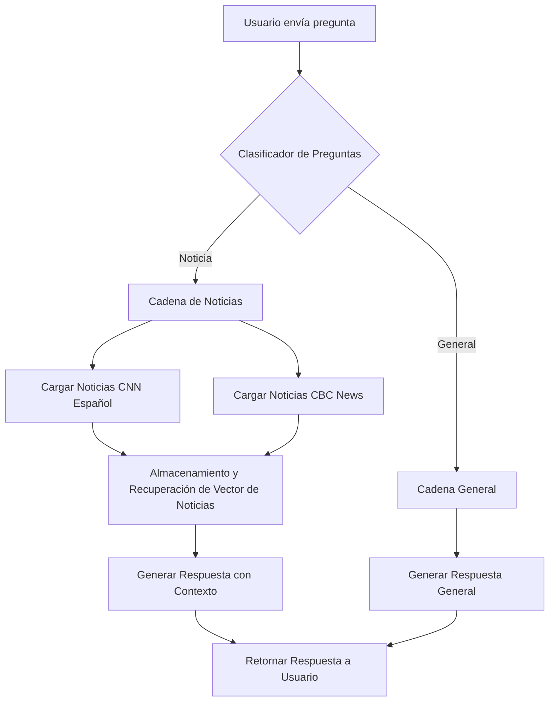

# Sistema de Consulta de Noticias

El challenge consiste en desarrollar un sistema de consulta de noticias que utiliza LangChain para ofrecer un servicio de consulta de noticias en tiempo real, extrayendo datos de CNN Español y CBC News. El sistema es capaz de determinar dinámicamente si debe ofrecer información específica de noticias o responder con conocimientos generales relacionados.




## Entregable Final

Los estudiantes desarrollarán una aplicación que utilice LangChain para ofrecer un servicio de consulta de noticias en tiempo real. Esta aplicación será capaz de:

- Extraer datos de CNN Español (https://cnnespanol.cnn.com/lite/) y CBC News (https://www.cbc.ca/lite/news?sort=latest) - Recursive Web Loader (https://js.langchain.com/v0.1/docs/integrations/document_loaders/web_loaders/recursive_url_loader/).
- Responder dinámicamente con información específica de noticias o conocimientos generales.
- Responder consultas generales.

## Objetivos de Aprendizaje

Al completar este proyecto, los estudiantes serán capaces de:

1. **Implementar cadenas de LangChain** para procesar noticias de múltiples fuentes en tiempo real.
2. **Utilizar el Lenguaje de Expresión de Langchain (LCEL)** para crear flujos de trabajo que decidan el tipo de respuesta basada en la consulta del usuario.
3. **Desarrollar habilidades para gestionar transmisiones de datos en vivo (streaming)** en aplicaciones basadas en LLM.
4. **Practicar la integración y manipulación de fuentes de noticias externas** en un chatbot.

## Requisitos Mínimos

Para completar este proyecto, los estudiantes deberán:

- **Utilizar las integraciones de LangChain** para cargar noticias de CNN Español y CBC News.
- **Implementar una cadena en LangChain** que decida si debe responder con información de noticias específica o proporcionar una respuesta basada en conocimientos generales, dependiendo de la naturaleza de la pregunta del usuario.
- **Configurar el sistema para responder en tiempo real**, utilizando las capacidades de streaming de LangChain.
- **Incluir comentarios claros y concisos en el código** para explicar la lógica de decisión y el manejo de datos.

## Valor Agregado (Puntos Extra)

Los estudiantes pueden ganar puntos extra por:

1. **Funcionalidad avanzada de memoria**: Implementar características de memoria en LangChain para recordar las preferencias de los usuarios y las interacciones anteriores, permitiendo respuestas más personalizadas y contextuales.
2. **Interfaz de usuario gráfica**: Crear una interfaz de usuario que facilite la interacción con el sistema de consulta de noticias, mejorando la experiencia del usuario final.

## Solucion: Configuración y Ejecución del Proyecto

Instrucciones detalladas sobre cómo configurar y ejecutar el proyecto en un entorno local.

### Pre-requisitos

- Node.js
- npm o yarn
- Acceso a las API de LangChain y OpenAI

### Instalación

1. Entrar al folder de solucion:
```
cd solucion
```

2. Instalar Dependencias
```
npm install
```
3. Variables de entorno:
```
export OPENAI_API_KEY=sk-...
```

###
Ejecución
Para iniciar el sistema de consulta de noticias:
```
node main.js
```